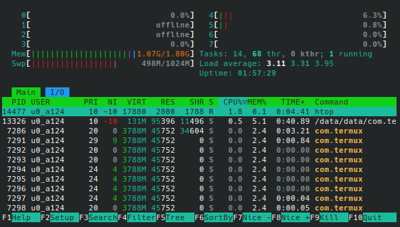

# Environment (Termux)

The processor/soc is: Snapdragon 617 8x Cortex-A53 NEON ARMv8-A


```python
! pkg install inxi -y
```

    Checking availability of current mirror:
    [*] https://mirrors.zju.edu.cn/termux/apt/termux-main: ok
    Reading package lists... Done
    Building dependency tree... Done
    Reading state information... Done
    The following NEW packages will be installed:
      inxi
    0 upgraded, 1 newly installed, 0 to remove and 21 not upgraded.
    Need to get 349 kB of archives.
    After this operation, 1458 kB of additional disk space will be used.
    Get:1 https://mirrors.zju.edu.cn/termux/apt/termux-main stable/main aarch64 inxi all 3.3.38-1-0 [349 kB]
    Fetched 349 kB in 27s (12.8 kB/s)                                              
    
    78Selecting previously unselected package inxi.
    (Reading database ... 24569 files and directories currently installed.)
    Preparing to unpack .../inxi_3.3.38-1-0_all.deb ...
    7Progress: [  0%] [..........................................................] 87Progress: [ 20%] [###########...............................................] 8Unpacking inxi (3.3.38-1-0) ...
    7Progress: [ 40%] [#######################...................................] 8Setting up inxi (3.3.38-1-0) ...
    7Progress: [ 60%] [##################################........................] 87Progress: [ 80%] [##############################################............] 8
    78


```python
! inxi
```

    CPU: 2x 4-core AArch64 (-MCP AMP-) speed/min/max: 332/499:403/1651:1210 MHz
    Kernel: 3.10.108-lk.r17_rev aarch64 Up: 1h 49m Mem: 1.14/1.8 GiB (63.2%)
    Storage: 14.56 GiB (198.6% used) Procs: 12 Shell: python3.12 inxi: 3.3.38


```python
! inxi -Cf
```

    CPU:
      Info: 2x 4-core model: AArch64 bits: 64 type: MCP AMP
      Speed (MHz): avg: 332 min/max: 499:403/1651:1210 cores: 1: 0 2: 0 3: 499
        4: 499 5: 499 6: 499
      Features: aes asimd crc32 evtstrm fp pmull sha1 sha2


```python
! inxi -F
```

    System:
      Host: localhost Kernel: 3.10.108-lk.r17_rev arch: aarch64 bits: 64
      Console: pty pts/3 Distro: Android
    Machine:
      Type: ARM System: Athene_13MP details: Qualcomm MSM8952 rev: 82ad
    Battery:
      ID-1: battery charge: 100% condition: N/A
    CPU:
      Info: 2x 4-core model: AArch64 variant: armv8 bits: 64 type: MCP AMP
      Speed (MHz): avg: 332 min/max: 499:403/1651:1210 cores: 1: 0 2: 0 3: 499
        4: 499 5: 499 6: 499
    Graphics:
      Device-1: msm-dai-q6-hdmi driver: msm_dai_q6_hdmi v: N/A
      Device-2: msm-dai-q6-mi2s-hdmi driver: msm_dai_q6_mi2s_hdmi v: N/A
      Display: server: No display server data found. Headless machine?
        tty: 80x40
      API: N/A Message: No API data available in console. Headless machine?
      Info: Tools: No graphics tools found.
    Audio:
      Device-1: msm8952-audio-codec driver: msm8952_asoc_wcd
      Device-2: msm-audio-ion driver: msm_audio_ion
      Device-3: msm-dai-q6-hdmi driver: msm_dai_q6_hdmi
      Device-4: msm-dai-q6-mi2s-hdmi driver: msm_dai_q6_mi2s_hdmi
      Device-5: msmapr-audio driver: adsp_audio
      API: ALSA v: k3.10.108-lk.r17_rev status: kernel-api
    Network:
      Device-1: wcnss_wlan driver: wcnss_wlan
      IF: p2p0 state: down mac: 6a:c4:4d:c0:cd:56
      IF-ID-1: dummy0 state: unknown speed: N/A duplex: N/A
        mac: a6:02:8d:88:71:be
      IF-ID-2: r_rmnet_data0 state: down mac: N/A
      IF-ID-3: r_rmnet_data1 state: down mac: N/A
      IF-ID-4: r_rmnet_data2 state: down mac: N/A
      IF-ID-5: r_rmnet_data3 state: down mac: N/A
      IF-ID-6: r_rmnet_data4 state: down mac: N/A
      IF-ID-7: r_rmnet_data5 state: down mac: N/A
      IF-ID-8: r_rmnet_data6 state: down mac: N/A
      IF-ID-9: r_rmnet_data7 state: down mac: N/A
      IF-ID-10: r_rmnet_data8 state: down mac: N/A
      IF-ID-11: rmnet_data0 state: down mac: N/A
      IF-ID-12: rmnet_data1 state: down mac: N/A
      IF-ID-13: rmnet_data2 state: down mac: N/A
      IF-ID-14: rmnet_data3 state: down mac: N/A
      IF-ID-15: rmnet_data4 state: down mac: N/A
      IF-ID-16: rmnet_data5 state: down mac: N/A
      IF-ID-17: rmnet_data6 state: down mac: N/A
      IF-ID-18: rmnet_data7 state: down mac: N/A
      IF-ID-19: rmnet_ipa0 state: unknown speed: N/A duplex: N/A mac: N/A
      IF-ID-20: sit0 state: down mac: 00:00:00:00
      IF-ID-21: usb0 state: down mac: 12:40:d1:e7:c7:30
      IF-ID-22: wlan0 state: up mac: 68:c4:4d:c0:cd:56
    Drives:
      Local Storage: total: 14.56 GiB used: 28.92 GiB (198.6%)
      ID-1: /dev/mmcblk0 model: QE13MB size: 14.56 GiB
    Partition:
      ID-1: /cache size: 463.9 MiB used: 352 KiB (0.1%) fs: n/a
        dev: /dev/mmcblk0p46
      ID-2: /data size: 21.65 GiB used: 12.61 GiB (58.2%) fs: n/a
        dev: /dev/mmcblk0p48
      ID-3: /firmware size: 188.8 MiB used: 139.2 MiB (73.7%) fs: n/a
        dev: /dev/mmcblk0p1
      ID-4: /system size: 4.77 GiB used: 3.69 GiB (77.4%) fs: n/a
        dev: /dev/mmcblk0p47
    Swap:
      ID-1: swap-1 type: zram size: 1024 MiB used: 506.5 MiB (49.5%)
        dev: /dev/block/zram0
    Use of uninitialized value in substitution (s///) at /data/data/com.termux/files/usr/bin/inxi line 27663.
    Use of uninitialized value in concatenation (.) or string at /data/data/com.termux/files/usr/bin/inxi line 27664.
    Use of uninitialized value in substitution (s///) at /data/data/com.termux/files/usr/bin/inxi line 27663.
    Use of uninitialized value in concatenation (.) or string at /data/data/com.termux/files/usr/bin/inxi line 27664.
    Use of uninitialized value in substitution (s///) at /data/data/com.termux/files/usr/bin/inxi line 27663.
    Use of uninitialized value in concatenation (.) or string at /data/data/com.termux/files/usr/bin/inxi line 27664.
    Use of uninitialized value in substitution (s///) at /data/data/com.termux/files/usr/bin/inxi line 27663.
    Use of uninitialized value in concatenation (.) or string at /data/data/com.termux/files/usr/bin/inxi line 27664.
    Use of uninitialized value in substitution (s///) at /data/data/com.termux/files/usr/bin/inxi line 27663.
    Use of uninitialized value in concatenation (.) or string at /data/data/com.termux/files/usr/bin/inxi line 27664.
    Use of uninitialized value in substitution (s///) at /data/data/com.termux/files/usr/bin/inxi line 27663.
    Use of uninitialized value in concatenation (.) or string at /data/data/com.termux/files/usr/bin/inxi line 27664.
    Use of uninitialized value in substitution (s///) at /data/data/com.termux/files/usr/bin/inxi line 27663.
    Use of uninitialized value in concatenation (.) or string at /data/data/com.termux/files/usr/bin/inxi line 27664.
    Use of uninitialized value in substitution (s///) at /data/data/com.termux/files/usr/bin/inxi line 27663.
    Use of uninitialized value in concatenation (.) or string at /data/data/com.termux/files/usr/bin/inxi line 27664.
    Use of uninitialized value in substitution (s///) at /data/data/com.termux/files/usr/bin/inxi line 27663.
    Use of uninitialized value in concatenation (.) or string at /data/data/com.termux/files/usr/bin/inxi line 27664.
    Use of uninitialized value in substitution (s///) at /data/data/com.termux/files/usr/bin/inxi line 27663.
    Use of uninitialized value in concatenation (.) or string at /data/data/com.termux/files/usr/bin/inxi line 27664.
    Use of uninitialized value in substitution (s///) at /data/data/com.termux/files/usr/bin/inxi line 27663.
    Use of uninitialized value in concatenation (.) or string at /data/data/com.termux/files/usr/bin/inxi line 27664.
    Use of uninitialized value in substitution (s///) at /data/data/com.termux/files/usr/bin/inxi line 27663.
    Use of uninitialized value in concatenation (.) or string at /data/data/com.termux/files/usr/bin/inxi line 27664.
    Use of uninitialized value in substitution (s///) at /data/data/com.termux/files/usr/bin/inxi line 27663.
    Use of uninitialized value in concatenation (.) or string at /data/data/com.termux/files/usr/bin/inxi line 27664.
    Use of uninitialized value in substitution (s///) at /data/data/com.termux/files/usr/bin/inxi line 27663.
    Use of uninitialized value in concatenation (.) or string at /data/data/com.termux/files/usr/bin/inxi line 27664.
    Use of uninitialized value in substitution (s///) at /data/data/com.termux/files/usr/bin/inxi line 27663.
    Use of uninitialized value in concatenation (.) or string at /data/data/com.termux/files/usr/bin/inxi line 27664.
    Use of uninitialized value in substitution (s///) at /data/data/com.termux/files/usr/bin/inxi line 27663.
    Use of uninitialized value in concatenation (.) or string at /data/data/com.termux/files/usr/bin/inxi line 27664.
    Use of uninitialized value in substitution (s///) at /data/data/com.termux/files/usr/bin/inxi line 27663.
    Use of uninitialized value in concatenation (.) or string at /data/data/com.termux/files/usr/bin/inxi line 27664.
    Use of uninitialized value in substitution (s///) at /data/data/com.termux/files/usr/bin/inxi line 27663.
    Use of uninitialized value in concatenation (.) or string at /data/data/com.termux/files/usr/bin/inxi line 27664.
    Use of uninitialized value in substitution (s///) at /data/data/com.termux/files/usr/bin/inxi line 27663.
    Use of uninitialized value in concatenation (.) or string at /data/data/com.termux/files/usr/bin/inxi line 27664.
    Use of uninitialized value in substitution (s///) at /data/data/com.termux/files/usr/bin/inxi line 27663.
    Use of uninitialized value in concatenation (.) or string at /data/data/com.termux/files/usr/bin/inxi line 27664.
    Use of uninitialized value in substitution (s///) at /data/data/com.termux/files/usr/bin/inxi line 27663.
    Use of uninitialized value in concatenation (.) or string at /data/data/com.termux/files/usr/bin/inxi line 27664.
    Sensors:
      Src: /sys System Temperatures: cpu: 31.2 C mobo: N/A
      Fan Speeds (rpm): N/A
    Info:
      Memory: total: N/A available: 1.8 GiB used: 1.14 GiB (63.5%)
      Processes: 12 Uptime: 1h 50m Init: N/A Shell: python3.12 inxi: 3.3.38


TOP:




```python

```
